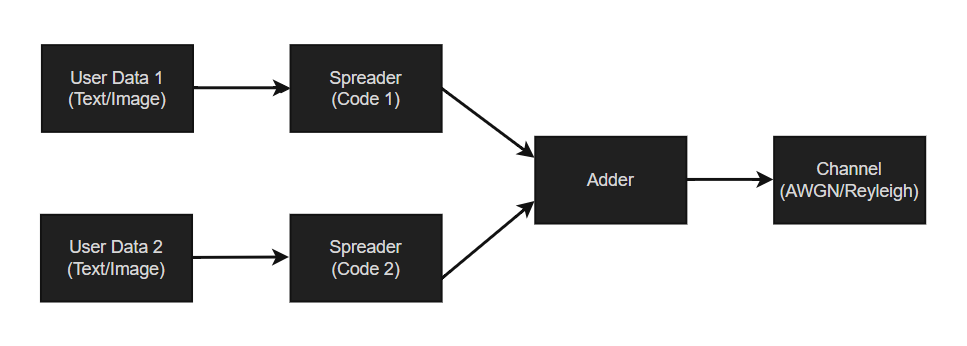
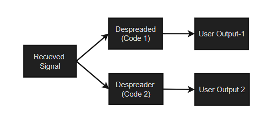

# CDMA-for-Data-Image-Transmission

## Overview

This project studies and implements a Code Division Multiple Access (CDMA) communication system using Gold sequences. The system is evaluated under both Additive White Gaussian Noise (AWGN) and Rayleigh fading channels to analyze communication reliability and bit error rate (BER) performance.

## Objectives

- Generate and analyze PN sequences.
- Generate Gold sequences with improved cross-correlation properties.
- Implement a two-user CDMA transmitter and receiver.
- Transmit and recover image and text data.
- Evaluate BER performance under AWGN and Rayleigh fading channels.

## System Architecture
### Transmitter

### Receiver

## Theory
### PN Sequence Generation
### Gold Sequence Generation
### BPSK Modulation
### Two-User CDMA System
### Text Transmission Using CDMA
### Image Transmission Using CDMA
### CDMA in Noisy Channels
### Performance over AWGN and Rayleigh Fading Channels
### BER vs SNR Analysis

## Results
- Successful recovery of transmitted image and text data.
- Gold sequences demonstrated improved user separation compared to standard PN sequences.
- Longer Gold codes provided better performance.
- BER decreased with increasing SNR.

